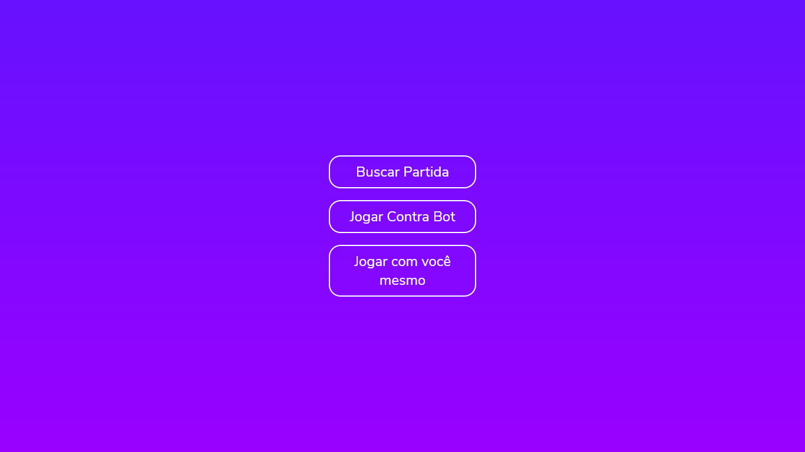
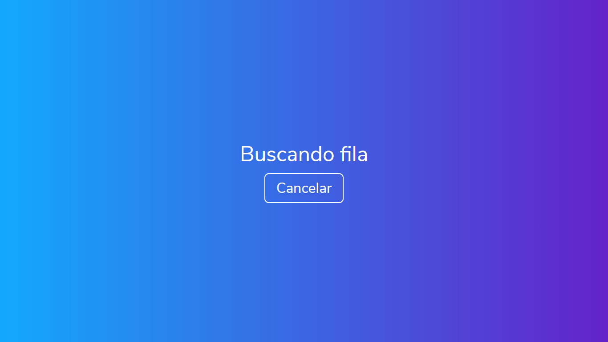
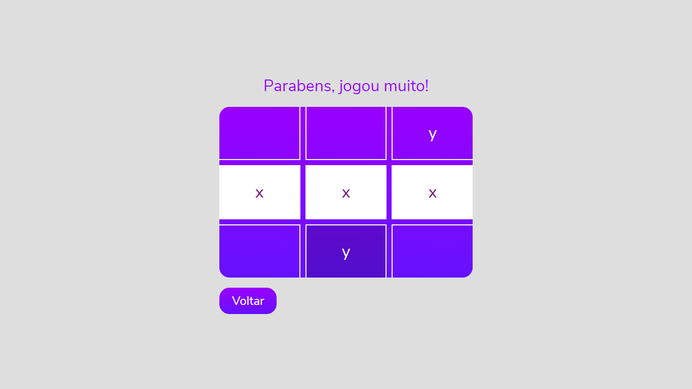

# game-multiplayer

  
  
  
  

<h3 align="center">Jogo da velha multiplayer</h3>

Um jogo da velha multiplayer
  <a href="https://tic-tack-toe-online.herokuapp.com/">tic-tack-toe-online</a>

   

<h3>Informações gerais</h3>

#### Tela inicial

#### Tela de busca por fila

#### Tela de jogo

